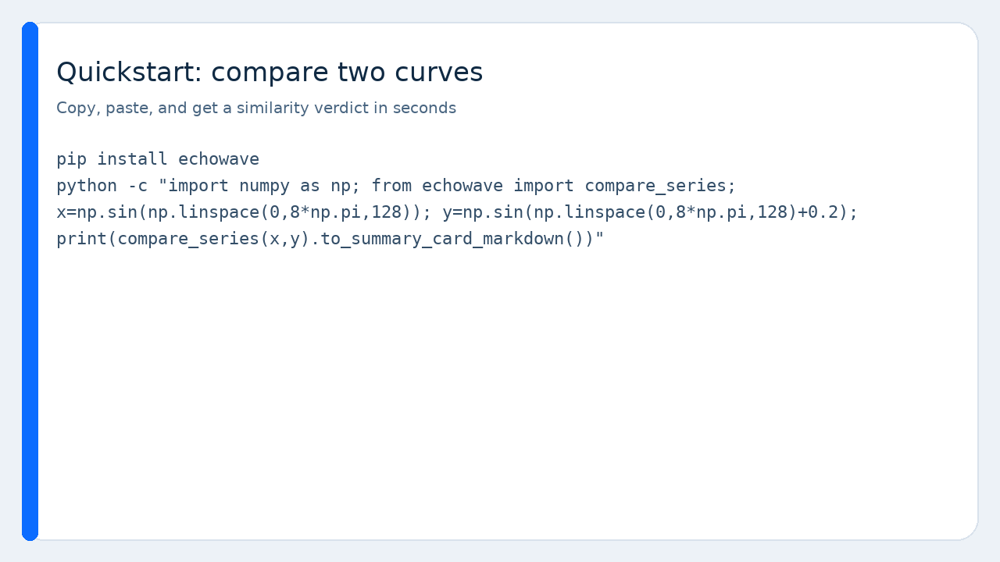
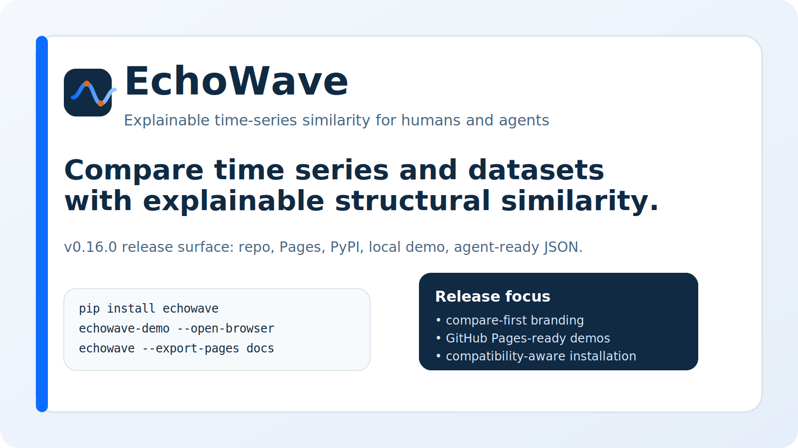

# EchoWave

> **Compare time series and datasets with explainable structural similarity.**

[](https://pypi.org/project/echowave/)
[](https://pypi.org/project/echowave/)
[](LICENSE)
[](https://github.com/ZipengWu365/EchoWave)
[](https://zipengwu365.github.io/EchoWave/)
[](https://github.com/ZipengWu365/EchoWave)
[](https://www.birmingham.ac.uk/)





**EchoWave** is an **explainable time-series similarity package for humans and agents.** It is built for the moment when a raw distance score is not enough: compare trajectories, compare datasets at the structural level, and hand the result to another person or another agent.

Formerly released as **tsontology**. The legacy package name and CLI aliases still work for compatibility.

**What it is:** EchoWave compares time series and time-series datasets, explains why they match or differ, and emits compact JSON plus shareable HTML reports.

**What it is not:** a forecasting library, a classifier library, a fastest-possible DTW engine, or a motif-mining toolkit.

## 60-second quickstart

```bash
pip install echowave
python -c "import numpy as np; from echowave import compare_series; x=np.sin(np.linspace(0,8*np.pi,128)); y=np.sin(np.linspace(0,8*np.pi,128)+0.2); print(compare_series(x,y).to_summary_card_markdown())"
```

Expected output starts like this:

```text
# EchoWave similarity summary
overall similarity: ...
top components: shape similarity, trend similarity, spectral similarity
```

## Why teams use this before or beside a model

Because many time-series teams do not just need a distance score. They need to know whether two curves are similar enough to compare, whether two datasets are structurally similar enough to transfer intuition, and why the package thinks that.

## What you get right away

- plain-English similarity summaries
- time-series and dataset-level structural comparison
- shareable HTML reports with visuals
- rolling similarity and component breakdowns
- compact agent JSON with stable envelopes
- starter datasets, notebooks, and GitHub Pages-ready similarity demos
- a local live demo server for pasted arrays and quick comparisons
- compatibility presets and environment doctor guidance for mixed scientific stacks

## Zero-install and low-friction entry points

- **Static playground** - Preview similarity reports, visuals, and flagship cases without installing Python or starting a server.
- **Colab quickstart** - Open a starter notebook in a hosted notebook environment.
- **uvx CLI** - Run the CLI in an isolated ephemeral environment when packaging allows it.
- **Local demo server** - Run a tiny local web app that turns pasted values into similarity verdicts on your own machine.

- **GitHub Pages-ready showcase** - open `docs/index.html` or publish the included Pages bundle.
- **Local live demo server** - run `echowave-demo --open-browser` for real similarity analysis on pasted arrays.
- **Legacy CLI alias** - `tsontology-demo --open-browser` continues to work while older notebooks and scripts migrate.
- **Local static preview** - open `playground.html` locally and switch between flagship similarity cases.
- **Compatibility presets** - export a constraints file before installing into a mixed scientific stack.

## Beginner examples

- **Single-column CSV -> similarity-ready signal** - Show that one numeric column is enough to try the package.
- **Timestamps + missingness -> why irregularity matters** - Show why explicit timestamps and gaps can change a similarity verdict.
- **Two curves -> similarity verdict** - Show the simplest possible similarity workflow without ontology jargon.
- **Inflation + search interest -> regime similarity** - Show a macro-adjacent beginner case without assuming a finance background.
- **Single sensor drift -> structural watchouts** - Show how slow drift changes what a meaningful analog looks like in engineering data.
- **Daily survey sentiment -> irregularity and burstiness** - Show how sparse observational signals differ from smooth telemetry.

## Flagship demos

- **OpenClaw-style GitHub breakout analogs** - Ask whether a new repo looks like a durable breakout or a short viral spike.
- **BTC vs gold vs oil under shocks** - Ask which assets become more similar during macro or geopolitical stress.
- **Heatwave vs grid load** - Ask which load curves drift or switch regime under extreme weather.

## Three copy-paste entry points

```python
import numpy as np
from echowave import compare_series, explain_similarity, ts_compare

x = np.sin(np.linspace(0, 8*np.pi, 128))
y = np.sin(np.linspace(0, 8*np.pi, 128) + 0.2)

print(compare_series(x, y).to_summary_card_markdown())
print(explain_similarity(x, y))
print(ts_compare(x, y))
```

## Example outputs in this repo

- [Weekly website traffic HTML report](examples/outputs/weekly_website_traffic_report.html)
- [Irregular patient vitals HTML report](examples/outputs/irregular_patient_vitals_report.html)
- [GitHub breakout similarity HTML report](examples/outputs/github_breakout_similarity.html)
- [BTC vs gold similarity HTML report](examples/outputs/btc_vs_gold_similarity.html)
- [Energy load vs heatwave HTML report](examples/outputs/energy_load_heatwave_report.html)
- [Wearable recovery HTML report](examples/outputs/wearable_recovery_report.html)

## Author

- **Maintainer:** Zipeng Wu
- **Email:** zxw365@student.bham.ac.uk
- **Affiliation:** The University of Birmingham
- **Repository:** https://github.com/ZipengWu365/EchoWave
- **Documentation:** https://zipengwu365.github.io/EchoWave/

## Starter datasets, notebooks, and integration templates

- [Starter datasets](STARTER_DATASETS.md)
- [Compatibility guide](COMPATIBILITY.md)
- [Environment doctor](DOCTOR.md)
- [Example gallery](EXAMPLES_GALLERY.md)
- [Notebooks](examples/notebooks)
- [Integration templates](INTEGRATIONS.md)
- [Decision stories](CASE_STUDIES.md)
- [Static playground](playground.html)
- [Local live demo guide](LIVE_DEMO.md)
- [Routing contracts](ROUTING_CONTRACTS.md)

## Agent-ready by design

This version exposes compare-first stable wrappers:

- `ts_profile`
- `ts_compare`
- `ts_route`

All wrappers ship an explicit input contract and a stable success/error envelope. They are meant to be the smallest useful tool surface for function calling, MCP, and multi-agent handoff.

See:

- [Agent schemas](AGENT_SCHEMAS.md)
- [OpenAI function schemas](OPENAI_FUNCTION_SCHEMAS.json)
- [MCP tool descriptors](MCP_TOOL_DESCRIPTORS.json)
- [Agent input contract](AGENT_INPUT_CONTRACT.md)

## Zero-install and deployment docs

- [Zero-install guide](ZERO_INSTALL.md)
- [GitHub Pages deployment](PAGES_DEPLOYMENT.md)
- [Playground guide](PLAYGROUND.md)
- [Local live demo guide](LIVE_DEMO.md)
- [PyPI long description](PYPI_LONG_DESCRIPTION.md)

<!-- Where tsontology fits in the ecosystem -->
## Where EchoWave fits in the ecosystem

Use EchoWave first when you need **explainable structural similarity and comparison**.

Pair it with other libraries when you move into:

- feature extraction (`tsfresh`)
- forecasting (`Darts`, `sktime`, `aeon`, `Kats`)
- learning pipelines (`aeon`, `sktime`, `tslearn`)
- DTW alignment (`DTAIDistance`)
- motif / discord mining (`STUMPY`)

## Capability coverage

- **Primary:** series similarity, dataset similarity, similarity reports, agent context
- **Complementary:** structural profiling, benchmark curation, modelling handoff
- **Out of scope:** estimator training, backtesting, low-level DTW paths, subsequence mining

## Integrations

- pandas / parquet pipelines
- xarray-style data
- Jupyter notebooks
- CLI batch workflows
- OpenAI function calling
- MCP tool wrappers
- GitHub Pages static showcase

## Trust layer

- [LICENSE](LICENSE)
- [CONTRIBUTING.md](CONTRIBUTING.md)
- [CODE_OF_CONDUCT.md](CODE_OF_CONDUCT.md)
- [CITATION.cff](CITATION.cff)
- beta-level agent schemas
- beginner and flagship notebooks
- Pages-ready demo bundle
- social cards and GIFs
- reproducible decision-impact benchmark

## License

MIT.
